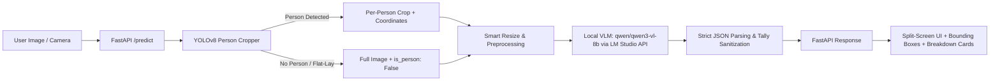

# 🧺 Laundry AI: Multi-Modal Clothing Detection & Scanner

[](https://pytorch.org/)
[](https://fastapi.tiangolo.com/)
[](https://github.com/ultralytics/ultralytics)
[](https://huggingface.co/Qwen)

**Laundry AI** is an end-to-end computer vision and multi-modal intelligence application designed to automatically detect, crop, and classify clothing items in real-world images. It combines a **Two-Stage Multi-Person Localization Pipeline (YOLOv8)** with a **Local Vision-Language Model (`qwen/qwen3-vl-8b` via LM Studio)** to audit worn outfits, flat-lays, folded garments, and laundry piles through an interactive, glassmorphic web dashboard.

---

## 🌟 Key Highlights & Capabilities

- 👥 **Multi-Person Localization**: Uses YOLOv8 to locate and isolate individuals across crowded or group photos, extracting bounding boxes with proportional coordinate overlays.
- 👗 **Multi-Modal Garment Classification**: Integrated **`qwen/qwen3-vl-8b`** Vision-Language Model running locally in LM Studio for granular clothing category, color, and count recognition.
- 🧺 **Folded, Overlapping & Awkward Piles Detection**: Built-in visual prompt engineering guides the model to inspect structural garment hallmarks (collars, waistbands, buttons, fly zippers, hems) and identify underlying garments in overlapping arrangements.
- 🚫 **Background Fabric Rejection**: Explicitly rejects bedsheets, blankets, duvet covers, towels, and carpets, preventing floral or striped bedding from being falsely counted as clothing.
- 📸 **Live In-App Camera Scanner**: Includes a dedicated viewfinder modal with HUD scanning reticle, animated laser guide, front/rear camera switching, and preview confirmation.
- 📁 **Local Storage & Drag-and-Drop**: Easily browse `.jpg`, `.png`, and `.webp` images directly from your computer or drag and drop files into the scanner.
- ⚡ **FastAPI In-Memory Backend**: Asynchronous REST API serving in-memory image processing and static frontend assets with CORS support.

---

## 🏗️ Architecture & Pipeline Overview



1. **Ingestion**: The user uploads an image via the web dashboard or takes a snapshot directly through the live camera viewfinder.
2. **Detection & Spatial Cropping**: 
   - YOLOv8 detects all persons (`cls == 0`) with confidence thresholding ($\ge 0.40$) and adds a 5% margin.
   - If no person is detected (e.g., folded laundry or clothes laid on a bed), the entire image is processed with `is_person: False`.
3. **Pre-processing**: Dynamic aspect-ratio resizing (capped at 1024px) preserves texture while keeping VLM token usage fast and memory-efficient.
4. **Structured VLM Prompting**: Dispatches the image crop to a local Vision-Language Model with deterministic JSON constraints, negative exclusions (no bedsheets, no accessories), and structural garment recognition cues.
5. **Aggregation & Frontend Overlay**: The backend returns master tallies and per-subject items, dynamically rendering glowing bounding boxes and clothing count cards.

---

## 📂 Repository Structure

```
ResNet-Apex/
├── frontend/                     # Web Scanner Dashboard
│   ├── app.js                   # Camera controller, API client & bounding boxes
│   ├── index.html               # Semantic HTML5 dashboard layout
│   └── style.css                # Glassmorphism dark-theme styling & HUD reticle
├── src/                         # Backend and pipeline source code
│   ├── api.py                   # FastAPI server & static file mount
│   ├── detector.py              # YOLOv8 person detector & cropper
│   ├── image_processor.py       # CLAHE, resizing & base64 utilities
│   ├── pipeline.py              # Modular end-to-end pipeline coordinator
│   └── vlm_client.py            # Local VLM client & prompt engineering
├── environment.yml              # Conda environment definition (image-ai)
├── requirements.txt             # Pip dependency specifications
├── yolov8n.pt                   # YOLOv8 pre-trained weights
├── .env.example                 # Example environment variables
└── README.md                    # Project documentation
```

---

## 🚀 Complete Walkthrough & Local Setup Guide

Follow this guide to run the complete application locally on your machine, from downloading the Vision LLM in LM Studio to launching the interactive camera scanner dashboard.

---

### Step 1: Setting Up LM Studio & Local Vision Model

The clothing classification engine connects to a local OpenAI-compatible Vision-Language Model (VLM). We recommend **LM Studio** for its easy GUI and fast GPU-accelerated inference.

#### 1. Download & Install LM Studio
- Download LM Studio for your operating system (macOS Apple Silicon/Intel, Windows, or Linux) from:
  👉 **[https://lmstudio.ai](https://lmstudio.ai)**
- Install and launch the application.

#### 2. Download the Vision Model (`qwen/qwen3-vl-8b`)
The clothing classifier is optimized for **`qwen/qwen3-vl-8b`**:
1. In LM Studio, click the **Search / Magnifying Glass** icon on the left sidebar.
2. Search for:
   ```text
   qwen/qwen3-vl-8b
   ```
3. Select and download the model (e.g. `Q4_K_M` recommended for balanced memory footprint, or higher quantization if supported by your hardware).
4. Click **Download**.

#### 3. Start the Local Developer Server
1. Click the **Local Server** icon (`<->` double-arrow) on the left sidebar in LM Studio.
2. At the top of the screen, select **`qwen/qwen3-vl-8b`** from the model dropdown to load it into memory.
3. In the right-hand **Server Configuration** panel:
   - **Port**: `1234` *(default)*
   - **Context Length**: Set to **`4096`** or **`8192`** *(ensures enough token room for high-res images)*
   - **GPU Offload**: Toggle **ON** (Apple Silicon Metal / Nvidia CUDA) and allocate maximum layers to GPU for fast inference.
   - **Cross-Origin-Resource-Sharing (CORS)**: Toggle **ON**.
4. Click **Start Server** (green button).

#### 4. Verify Server Health
Open your terminal and run:
```bash
curl http://localhost:1234/v1/models
```
If configured properly, it will return a JSON list showing your active loaded model.

---

### Step 2: Clone the Project & Set Up Python Environment

You can configure the project environment using either **Conda** or **Pip/Virtualenv**.

#### Option A: Using Conda (Recommended)
```bash
# 1. Clone the repository
git clone https://github.com/acsuthar2006-ctrl/ResNet-Apex.git
cd ResNet-Apex

# 2. Create the conda environment from environment.yml
conda env create -f environment.yml

# 3. Activate the environment
conda activate image-ai
```

#### Option B: Using Standard Python Virtual Environment (`venv` + `pip`)
```bash
# 1. Clone the repository
git clone https://github.com/acsuthar2006-ctrl/ResNet-Apex.git
cd ResNet-Apex

# 2. Create and activate a Python virtual environment (Python 3.10+ recommended)
python3 -m venv .venv
source .venv/bin/activate       # On macOS / Linux
# .venv\Scripts\activate        # On Windows

# 3. Install all dependencies
pip install -r requirements.txt
```

---

### Step 3: Configure Environment Variables

Create a `.env` file in the project root directory (or update the provided `.env.example`):

```bash
cp .env.example .env
```

Ensure the configuration matches your LM Studio server settings:

```env
# URL where LM Studio local server is listening
VLM_API_URL=http://localhost:1234/v1/chat/completions

# Model identifier (set to your loaded model identifier in LM Studio)
VLM_MODEL_NAME=qwen/qwen3-vl-8b

# YOLO weights for person detection (bundled in repository)
YOLO_MODEL_PATH=yolov8n.pt
```

> [!TIP]
> You can check the exact model identifier under the **Loaded Model** banner at the top of LM Studio's Local Server tab. If unsure, leaving `qwen/qwen3-vl-8b` works with LM Studio's auto-forwarding to the currently loaded model.

---

### Step 4: Run the Application

Start the FastAPI application and dashboard server:

```bash
python src/api.py
```

The terminal will log the initialization steps:
```text
Initializing AI Pipeline (This will precompute 850 categories)...
Loading YOLO model from yolov8n.pt...
Initializing VLM Client pointing to http://localhost:1234/v1/chat/completions...
INFO:     Uvicorn running on http://127.0.0.1:8000 (Press CTRL+C to quit)
```

Open your browser and navigate to:
```
http://127.0.0.1:8000
```

---

### 🖥️ Step 5: Dashboard Walkthrough & User Guide

The dashboard provides two ways to add images:

#### Method 1: Local File Browsing / Drag-and-Drop
1. Click **Browse Files** to select any `.jpg`, `.png`, or `.webp` file from your device, or drag and drop an image directly into the upload area.
2. The image will be processed immediately through the dual-stage pipeline.

#### Method 2: Live In-App Camera Scanner
1. Click **Use Camera** on the upload screen.
2. Allow browser camera permissions when prompted.
3. Position garments inside the glowing **HUD viewfinder frame** (the animated scanning laser guides alignment).
4. If using a device with multiple lenses (e.g., mobile or laptop with front/rear cameras), use the **Flip Camera** button to toggle lenses.
5. Tap the circular **Shutter Button** to take a snapshot.
6. The preview freezes:
   - Click **Retake** to discard and return to the live stream.
   - Click **Use Photo** to send the snapshot directly to the AI pipeline.

#### Understanding Scan Results
- **Multi-Person Photos**: YOLOv8 draws glowing proportional bounding boxes around each person (`Person 1`, `Person 2`), and the right-hand panel displays an itemized garment breakdown for each individual.
- **Folded Clothes / Flat-Lay / Laundry Piles**: If no person is present, the pipeline switches to scene mode, isolating garments by structural hallmarks (collars, waistbands, buttons, seams) and ignoring background bedsheets/linens.
- **Repeat Scans**: Use the **Scan Another File** or **Take Another Photo** buttons to start a new scan without refreshing the page.

---

### 🔍 Troubleshooting & FAQ

#### 1. `API Error: Make sure model is running at http://localhost:1234`
- **Cause**: LM Studio local server is not started or listening on a different port.
- **Fix**: Open LM Studio, switch to the `<->` Local Server tab, verify the model is loaded, and click **Start Server**. Ensure the port in `.env` matches the port shown in LM Studio.

#### 2. `Camera Access Unavailable` in Browser
- **Cause**: Browser permissions denied or insecure origin.
- **Fix**: Check your browser address bar permissions (camera icon) and set camera permissions to **Allow**. Ensure you are accessing via `http://localhost:8000` or `http://127.0.0.1:8000` (which modern browsers treat as secure contexts). Alternatively, click **Use Device Camera / File** for native system file capture.

#### 3. LM Studio Runs Out of Memory (OOM)
- **Cause**: Selected quantization is too large for your system's VRAM/unified memory.
- **Fix**: Download a smaller quantization like `Q4_K_M` or `Q3_K_M`, or reduce context length from `8192` to `4096` in LM Studio's server settings.

#### 4. Port 8000 Already In Use
- **Cause**: Another process or background server is bound to port 8000.
- **Fix**: Free the port or run the server with custom port:
  ```bash
  uvicorn api:app --app-dir src --host 127.0.0.1 --port 8080 --reload
  ```
  *(Then navigate to `http://127.0.0.1:8080`)*.

---

## 📡 API Reference

### `POST /predict`

Submits an image for multi-person and garment detection.

- **Request Type**: `multipart/form-data`
- **Form Field**: `image` (binary image file)

#### Sample Response:

```json
{
  "tallies": {
    "striped button-down shirt": 1,
    "beige chinos": 1,
    "navy blue cardigan": 1
  },
  "people": [
    {
      "box": [120, 45, 480, 720],
      "is_person": true,
      "clothes": {
        "striped button-down shirt": 1,
        "beige chinos": 1
      }
    },
    {
      "box": [510, 80, 890, 700],
      "is_person": true,
      "clothes": {
        "navy blue cardigan": 1
      }
    }
  ]
}
```

---

## 🛠️ Tech Stack

- **Computer Vision & Object Detection**: Ultralytics YOLOv8, OpenCV (`cv2`), NumPy, Pillow
- **Vision-Language Model (VLM)**: `qwen/qwen3-vl-8b` (via local OpenAI-compatible API in LM Studio)
- **Deep Learning Framework**: PyTorch, Torchvision
- **Backend**: FastAPI, Uvicorn, Python-Multipart, Requests
- **Frontend**: Vanilla HTML5, Modern CSS3 Glassmorphism, JavaScript (ES6+ Web APIs, MediaDevices)

---

**Author**: [Aarya Suthar](https://github.com/acsuthar2006-ctrl)  
*For questions or suggestions, feel free to open an issue or pull request!*
