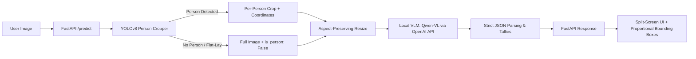

# ⚡ ResNet-Apex & Laundry AI Clothing Scanner

[](https://pytorch.org/)
[](https://fastapi.tiangolo.com/)
[](https://github.com/ultralytics/ultralytics)
[](https://huggingface.co/Qwen)

**ResNet-Apex** is an end-to-end computer vision and multi-modal intelligence platform. It brings together a custom high-capacity **ResNet9** deep learning model trained from scratch with an advanced **Two-Stage Multi-Person Clothing Detection & Classification Pipeline**, delivered through a sleek real-time web dashboard.

---

## 🌟 Key Highlights & System Capabilities

- 🧠 **ResNet-Apex (Custom ResNet9)**: 6.57M parameter custom convolutional architecture achieving **91.30% test accuracy** on CIFAR-10 from scratch using modern training recipes (AMP, Cosine Annealing, Random Erasing, AdamW).
- 👥 **Multi-Person Intelligent Localization**: Powered by YOLOv8 to locate and isolate individuals across crowded or group photos, accurately capturing coordinate bounding boxes `[x1, y1, x2, y2]`.
- 👗 **Multi-Modal Garment Classification**: Integrated Vision-Language Model (VLM, e.g., Qwen2.5-VL / Qwen3-VL via LM Studio/Ollama) for granular clothing extraction, color/style understanding, and accurate item counting.
- 🧺 **Flat-Lay & Folded Clothes Detection**: Seamless fallback pipeline with automated `is_person` classification to scan clothing stacks, folded laundry, or hanger layouts without hallucinating false human detections.
- ⚡ **Production-Ready FastAPI Backend**: Asynchronous REST API serving in-memory image processing and static assets with CORS enabled.
- 🎨 **Glassmorphism Web Scanner Dashboard**: Modern, responsive split-screen UI featuring drag-and-drop instant scanning and fluid percentage-based bounding box overlays.

---

## 🏗️ Architecture & Pipeline Overview

The system operates across two core modules: the **Training & Benchmarking Engine** and the **Production Inference Pipeline**.

### 1. Two-Stage Clothing Inference Pipeline



1. **Ingestion**: The user uploads an image via the web dashboard (or API).
2. **Detection & Spatial Cropping**: 
   - YOLOv8 detects all persons (`cls == 0`) with confidence thresholding ($\ge 0.40$).
   - Returns bounding boxes and crops for each person.
   - If no person is detected (e.g., folded laundry), the entire image is passed with `is_person: False`.
3. **Pre-processing & Optimization**: Dynamic aspect-ratio resizing (capped at 1024px) prevents memory bottlenecks and maximizes VLM token efficiency.
4. **Structured VLM Prompting**: The crop is dispatched to a local Vision-Language Model using structured system prompts designed for deterministic JSON outputs with strict negative constraints (no body parts, no furniture, exact counts).
5. **Aggregation & Response**: Results are grouped by person and aggregated into master tallies.
6. **Frontend Overlay**: Proportional `%`-based coordinates render glowing bounding box overlays and category cards in real time.

---

### 2. ResNet-Apex (Custom ResNet9 Model)

A high-capacity 9-layer Residual Network optimized for raw training efficiency:

```
Input (32x32x3) 
   │
   ├── Conv1 (64 channels) + BatchNorm + ReLU
   ├── Conv2 (128 channels) + MaxPool + ResidualBlock(128)
   ├── Conv3 (256 channels) + MaxPool
   ├── Conv4 (512 channels) + MaxPool + ResidualBlock(512)
   └── Classifier: MaxPool(4x4) + Flatten + Linear(512 -> num_classes)
```

#### Training Specifications
- **Parameters**: 6,575,370 (6.57 Million)
- **Dataset**: CIFAR-10 (50,000 train / 10,000 test)
- **Optimizer**: `AdamW(lr=1e-3, weight_decay=1e-4)`
- **Learning Rate Schedule**: `CosineAnnealingLR(T_max=150)`
- **Mixed Precision**: Native PyTorch AMP (`torch.cuda.amp` / `torch.mps`)
- **Augmentations**: `RandomCrop(32, padding=4)`, `RandomHorizontalFlip(p=0.5)`, `RandomErasing(p=0.1)`
- **Performance**: **91.30% Test Accuracy** (98.38% Train Accuracy)

---

## 📂 Repository Structure

```
ResNet-Apex/
├── frontend/                     # Web Scanner Dashboard
│   ├── app.js                   # Client logic & bounding box rendering
│   ├── index.html               # Semantic HTML5 dashboard layout
│   └── style.css                # Glassmorphism dark-theme styling
├── models/                      # Saved PyTorch model checkpoints (.pth)
├── notebooks/                   # Jupyter exploratory notebooks
├── src/                         # Backend and pipeline source code
│   ├── api.py                   # FastAPI application & static server
│   ├── categories.py            # Category definitions and mappings
│   ├── eval_metrics.py          # Precision/Recall/F1 evaluation
│   ├── pipeline.py              # YOLOv8 + VLM multi-modal pipeline
│   ├── predict.py               # Standalone CLI prediction script
│   ├── train.py                 # ResNet9 training loop
│   ├── datasets/                # Dataset loaders and augmentations
│   ├── models/                  # Neural network architecture definitions
│   └── utils/                   # General helper functions
├── yolov8n.pt                   # YOLOv8 nano pre-trained weights
├── yolov8m.pt                   # YOLOv8 medium pre-trained weights
├── requirements.txt             # Python dependencies
└── README.md                    # Project documentation
```

---

## 🚀 Quickstart & Setup Guide

### 1. Prerequisites
- **Python 3.10+** (Recommended: Python 3.11 or 3.12)
- **LM Studio** or **Ollama** running a Vision-Language Model (e.g. `qwen/qwen3-vl-8b` or `qwen2.5-vl-7b`) on local port `1234` or custom endpoint.

### 2. Installation

Clone the repository and install dependencies inside a virtual environment:

```bash
# Clone repository
git clone https://github.com/acsuthar2006-ctrl/ResNet-Apex.git
cd ResNet-Apex

# Create virtual environment
python3 -m venv .venv
source .venv/bin/activate  # On Windows: .venv\Scripts\activate

# Install dependencies
pip install -r requirements.txt
```

### 3. Configure Local VLM Endpoint

Create a `.env` file in the root directory (or use default LM Studio port):

```env
VLM_API_URL=http://localhost:1234/v1/chat/completions
VLM_MODEL_NAME=qwen/qwen3-vl-8b
YOLO_MODEL_PATH=yolov8n.pt
```

Make sure your local VLM server is running:
```bash
# Example with LM Studio CLI
lms server start
lms load qwen/qwen3-vl-8b
```

### 4. Launch the Application

Start the FastAPI server (which automatically serves the dashboard):

```bash
python src/api.py
```

Open your browser and navigate to:
```
http://127.0.0.1:8000
```

---

## 🖥️ Web Dashboard Usage

1. **Upload**: Drag and drop any image (group photo, single portrait, or folded garments) or click **Browse Files**.
2. **Real-time Scan**: The image is automatically decoded and forwarded to the dual-stage pipeline.
3. **Inspect Output**:
   - **Multi-person photos**: Each person receives a dedicated bounding box labeled **Person 1**, **Person 2**, etc., and a categorized itemized list.
   - **Flat-lay / Folded clothes**: Automatically categorized under **Detected Items** without phantom bounding boxes.
4. **Scan Another**: Click the **Scan Another** button to reset the view.

---

## 📡 API Reference

### `POST /predict`

Submits an image for multi-person and garment detection.

- **Request Type**: `multipart/form-data`
- **Form Field**: `image` (binary image file)

#### Sample Response:

```json
{
  "tallies": {
    "striped button-down shirt": 1,
    "beige chinos": 1,
    "navy blue cardigan": 1
  },
  "people": [
    {
      "box": [120, 45, 480, 720],
      "is_person": true,
      "clothes": {
        "striped button-down shirt": 1,
        "beige chinos": 1
      }
    },
    {
      "box": [510, 80, 890, 700],
      "is_person": true,
      "clothes": {
        "navy blue cardigan": 1
      }
    }
  ]
}
```

---

## 🏋️ Training Custom ResNet9 Models

To train the custom 6.57M ResNet-Apex architecture on CIFAR-10 or custom datasets:

```bash
# Run training script
python src/train.py --epochs 150 --batch-size 512 --lr 0.001
```

To evaluate checkpoints with full metrics:
```bash
python src/eval_metrics.py --checkpoint models/best_model.pth
```

---

## 📊 Benchmarks & Training Curves

| Model Architecture | Epochs | Params | Augmentations | Test Accuracy |
| :--- | :---: | :---: | :---: | :---: |
| Baseline ResNet | 50 | 1.2M | Basic | ~84.2% |
| **ResNet-Apex (Ours)** | **150** | **6.57M** | **RandomCrop + Flip + RandomErasing + AMP** | **91.30%** |

---

## 🛠️ Tech Stack

- **Deep Learning**: PyTorch, Torchvision, Ultralytics YOLOv8
- **Vision-Language Model**: Qwen2.5-VL / Qwen3-VL (via OpenAI-compatible API)
- **Computer Vision**: OpenCV (`cv2`), NumPy
- **Backend**: FastAPI, Uvicorn, Python-Multipart, Requests
- **Frontend**: Vanilla HTML5, CSS3 Glassmorphism, Modern JavaScript (ES6+)

---

## 📄 License

This project is licensed under the **MIT License**. See the [LICENSE](LICENSE) file for details.

---

**Author**: [Aarya Suthar](https://github.com/acsuthar2006-ctrl)  
*For questions or suggestions, feel free to open an issue or pull request!*
